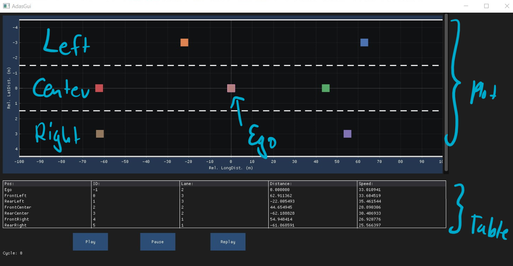

# Dear ImGUI Template to Start

## Example

This will be the complete GUI after the next exercise.


## Exercise

The new code will be added to the following files

- **Render.cc**
- **Render.hpp**
- **RenderConstants.hpp**

The GUI should display the following features:

- Tabular Plot with ImPlot
  - Plot the ID, distance and speed of all vehicles

```cpp
void plot_table(const VehicleType &ego_vehicle, const NeighborVehiclesType &vehicles)
{
    const auto num_cols = std::size_t{5};

    if (ImGui::Begin("TableWindow", nullptr, ...))
    {
        if (ImGui::BeginTable("Table", num_cols, ...))
        {


            ImGui::EndTable();
        }

        ImGui::End();
    }
}
```


