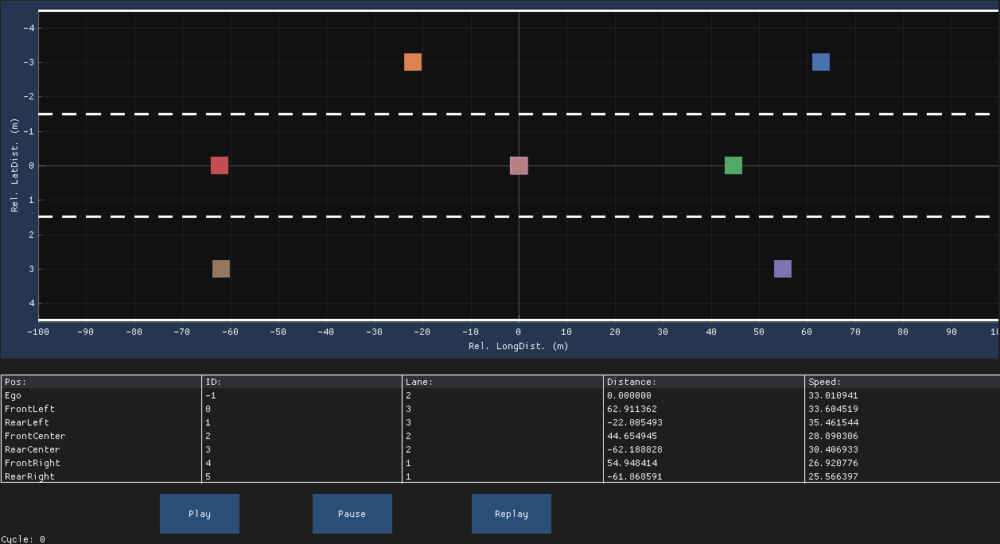

# Dear ImGUI Template to Start

## Example



## Exercise

The new code will be added to the following files

- **Render.cc**
- **Render.hpp**
- **RenderConstants.hpp**

The GUI should display the following features:

- Scatter Plot with ImPlot
  - The X Range is $\in [-100, 100]$
  - The Y Range is $\in [-4.5, 4.5]$
    - Note: The y-axis values are swapped (positive/negative swap)
  - Plot the lane borders
    - dashed: *gestrichelt*
    - solid: *durchgezogen*
  - Plot the position of the vehicles
    - The vehicles are always in the center of the lane
      - Left Lane Center: y = -3.0
      - Center Lane Center: y = 0.0
      - Right Lane Center: y = +3.0

```cpp
void plot_lanes(const VehicleType &ego_vehicle, const NeighborVehiclesType &vehicles)
{
    if (ImPlot::BeginPlot("Lanes"))
    {
        

        ImPlot::EndPlot();
    }
}
```


