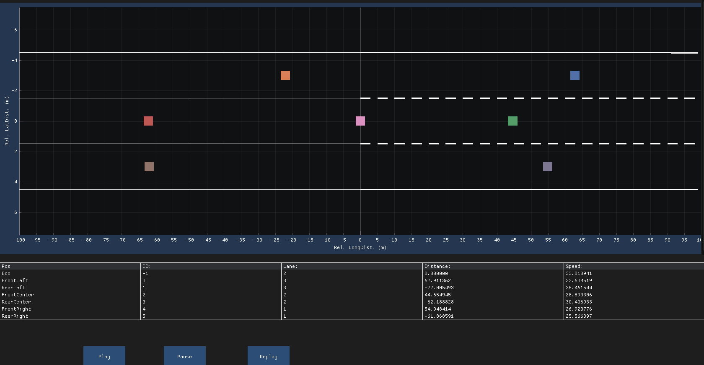

# Exercise

## Example



## Intro

In a self-driving car, the camera will deliver the lane information.  
In this exercise the lane boundary shape is given by a 3rd-degree polynomial:

$p(x) = a^3x + b^2x + cx + d$

If you plug in an x value (longitudinal distance in meter) you will get the lane position.  
Since our use case has 3 lanes in total and each lane has 2 lane borders (left and right border of each lane), there will be 6 polynomials in total.

Left Lane:

- Left Border (called LeftLeftBorder)
- Right Border (called LeftRightBorder)

Center Lane:

- Left Border (called CenterLeftBorder)
- Right Border (called CenterRightBorder)

Right Lane:

- Left Border (called RightLeftBorder)
- Right Border (called RightRightBorder)

Note:

LeftRightBorder and CenterLeftBorder are the same polynomials for now.  
CenterRightBorder and RightLeftBorder are the same polynomials for now.  

## Exercise

Use the new Lane structs from the AdTypes header to plot the lanes.  

```cpp
struct Polynomial3rdDegreeType
{
    float a;
    float b;
    float c;
    float d;

    /**
     * @brief To compute p(x) = a^3 * x + b^2 * x + c * x + d
     */
    float operator()(const float x) const
    {
        return 0.0F; // TODO
    }
};

struct LaneInformationType
{
    Polynomial3rdDegreeType left_polynomial;
    Polynomial3rdDegreeType right_polynomial;

    /**
     * @brief To compute the middle point of the two polynomials at pos. x
     */
    float get_lateral_position(const float x) const
    {
        return 0.0F; // TODO
    }
};

struct LanesInformationType
{
    LaneInformationType left_lane;
    LaneInformationType center_lane;
    LaneInformationType right_lane;
};
```

For plotting the lanes you have to use the polynomials.  
Note: The polynomials are only used to plot the lane in front of us (x > 0).  
The lane behind us will be just a straight line.  

Furthermore, we will plot the vehicle in the middle of the lanes.  
Hence, you have to compute the center point of the lane.  
