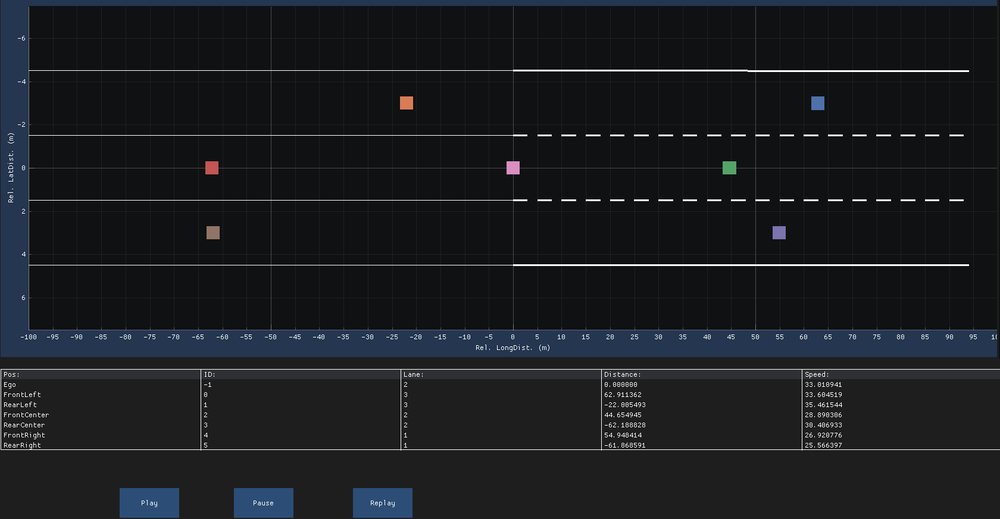

# Exercises

## Example



## Exercise

Add a new enum class for the lane boundary type with the following type:

- Dashed
- Solid
- None/Unknown

Add the following info to the *LaneInformationType* struct:

- Left boundary type (enum)
- Right boundary type (enum)
- View range of the left polynomial (float)
- View range of the right polynomial (float)

```cpp
struct LaneInformationType
{
    Polynomial3rdDegreeType left_polynomial;
    Polynomial3rdDegreeType right_polynomial;
    // TODO

    /**
     * @brief To compute the middle point of the two polynomials at pos. x
     */
    float get_lateral_position(const float x) const
    {
        if (x < 0.0F)
        {
            return (left_polynomial.d + right_polynomial.d) / 2.0F;
        }
        else
        {
            return (left_polynomial(x) + right_polynomial(x)) / 2.0F;
        }
    }
};
```

Update the plot lanes code such that the new lane information is used (view range for the lanes and the lane boundary types).
