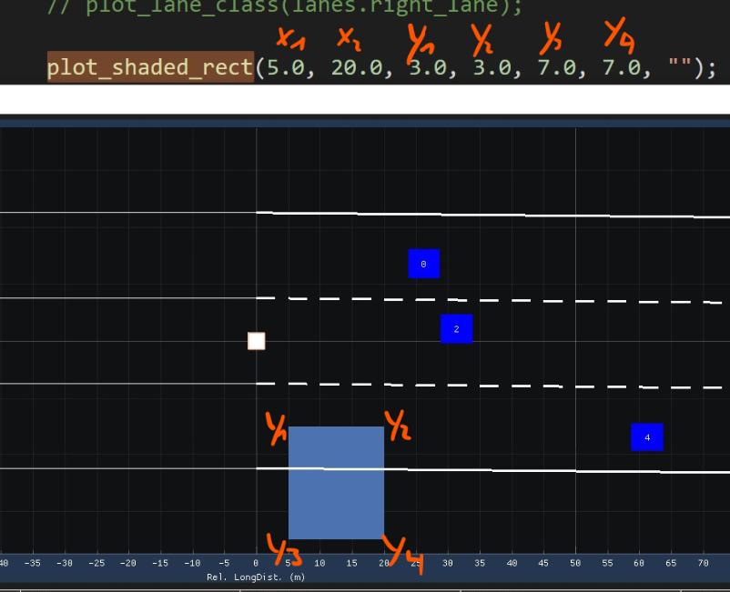

# Exercises

## Example


## Exercise

In this exercise, we will extend the vehicle and lane information.

### Intro

A new enum class for the ObjectClassType with the following type was added:

- car
- truck
- motorbike
- none/unknown

A new enum class for the LaneClassType with the following type was added:

- normal
- acceleration
- deceleration
- hard-shoulder
- none/unknown

The vehicle struct (from now on called *VehicleInformationType*) was extended:

```cpp
struct VehicleInformationType
{
    std::int32_t id;
    float width;
    float height;

    LaneAssociationType lane;
    ObjectClassType object_class;

    float speed_mps;
    float long_distance_m;
    float lat_distance_m;
};
```

Extend the lane struct:

```cpp
struct LaneInformationType
{
    Polynomial3rdDegreeType left_polynomial;
    Polynomial3rdDegreeType right_polynomial;

    LaneBoundaryType left_boundary_type;
    LaneBoundaryType right_boundary_type;

    float left_view_range_m;
    float right_view_range_m;

    float lane_width_m;
    LaneClassType lane_class;
};
```

The DataLoader code is also already updated for you.

### Exercise 1

Update the vehicle plotting code:

- Use the following mapping is used:
  - Ego Vehicle:
    - White
  - Other Car:
    - Blue
  - Truck:
    - Red
  - Motorbike:
    - Green
- To plot the vehicle marker, from now on we will use the function *plot_vehicle_marker* defined in the Render.cc file
- Such that the lateral and longitudinal distance is used

### Exercise 2

Update the lane clas plotting code:

- Such that the lane class is used to color the lane (space between the lane borders)
  - Normal: Green-ish color
  - Acceleration: Blue-ish color
  - Deceleration: Blue-ish color
  - Hard-Shoulder: Red-ish color
- Such that the ID of the vehicle is plotted nearby of the marker

Note: The colors are already defined in the RenderConstants.hpp

Hint:

Function for the lane class coloring the following function can be used to plot a rectangle:

```cpp
void plot_shaded_rect(const float x1,
                      const float x2,
                      const float y1,
                      const float y2,
                      const float y3,
                      const float y4,
                      std::string_view label)
{
    const auto num_points = size_t{2};

    const auto xs = std::array<float, num_points>{x1, x2};
    const auto ys1 = std::array<float, num_points>{y1, y2};
    const auto ys2 = std::array<float, num_points>{y3, y4};

    ImPlot::PlotShaded(label.data(), xs.data(), ys1.data(), ys2.data(), num_points);
}
```



### Exercise 3

- Update the ego vehicle plot function
  - Such that the longitudinal and lateral request is displayed
    - You can use a scatter point with a marker to indicate a lane change or braking request
